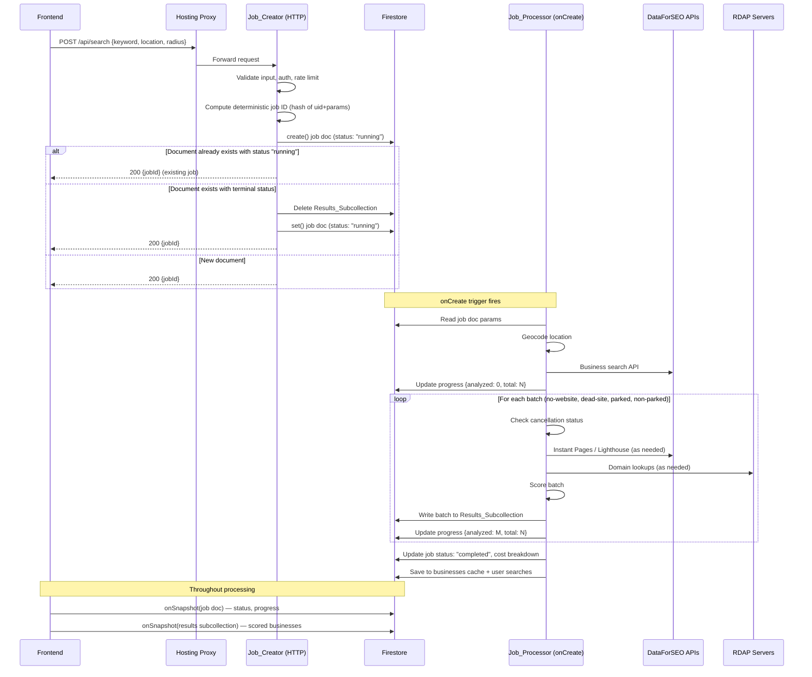

# Design Document: Async Search Jobs

## Overview

This design converts the lead search application from a synchronous request/response pattern to a job-based architecture. The current `dataforseoBusinessSearch` Cloud Function runs the entire search pipeline in a single HTTP request, which routinely exceeds Firebase Hosting's 60-second proxy timeout. The new architecture splits this into three concerns:

1. **Job Creation** — A fast HTTP endpoint that validates input, creates a Firestore job document, and returns immediately.
2. **Job Processing** — A Firestore `onCreate`-triggered function that runs the existing pipeline asynchronously, writing progress and results to Firestore.
3. **Real-time Consumption** — The frontend subscribes to the job document and results subcollection via `onSnapshot`, rendering results as they stream in.

The existing scoring, DFS client, RDAP, and geocode modules remain unchanged. Only the orchestration layer changes.

## Architecture



### Key Architectural Decisions

**Firestore `onCreate` trigger vs. Cloud Tasks / Pub/Sub**: We use a Firestore `onCreate` trigger because it requires zero additional infrastructure, integrates naturally with the Firestore-centric data model, and provides exactly-once delivery semantics (with retries disabled). Cloud Tasks would add complexity for no benefit since we already need Firestore for the job document.

**Results in subcollection vs. parent document**: Individual scored business documents go in `jobs/{jobId}/results/{cid}` rather than an array on the parent document. This avoids the 1 MB Firestore document size limit and allows the frontend to receive granular snapshot events per business rather than re-downloading the entire results array on every update.

**Deterministic job ID**: The job document ID is a SHA-256 hash of `uid + keyword + location + radius`. This makes duplicate prevention atomic — `create()` fails if the document exists, no check-then-create race condition.

**Retries disabled on Job_Processor**: The `onCreate` trigger is configured without `failurePolicy`, so a crash does not re-trigger the pipeline. This prevents double-spending on DFS/Lighthouse API credits. Stuck jobs are caught by the 5-minute cleanup scheduler.

**UID on result documents**: Each document in the Results_Subcollection carries a `uid` field so that Firestore security rules can authorize reads without a `get()` call on the parent document, avoiding per-document billed reads on every snapshot event.

## Components and Interfaces

### Backend Components

#### 1. Job_Creator (`functions/src/index.ts`)

Replaces the existing `dataforseoBusinessSearch` export. HTTP-triggered, behind `/api/search`.

```typescript
// POST /api/search
// Request body: { keyword: string, location: string, radius?: number }
// Response: { jobId: string }

interface CreateJobResponse {
  jobId: string;
}
```

Responsibilities:
- Auth verification (existing `verifyAuth`)
- Rate limiting (existing `isRateLimited`)
- Input validation/sanitization (existing helpers)
- Compute deterministic job ID: `sha256(uid + "|" + keyword + "|" + location + "|" + radius)`
- Attempt `create()` on `jobs/{jobId}`
- On `ALREADY_EXISTS`: read existing doc, return jobId if running, or clear subcollection + `set()` if terminal
- Return `{ jobId }` immediately

#### 2. Job_Processor (`functions/src/index.ts`)

New Firestore `onCreate` trigger export.

```typescript
// Firestore onCreate trigger on "jobs/{jobId}"
// Reads job doc params, runs pipeline, writes progress + results

export const processSearchJob = functions
  .runWith({ timeoutSeconds: 300 })
  .firestore.document("jobs/{jobId}")
  .onCreate(async (snap, context) => { ... });
```

Responsibilities:
- Read `params` from the created job document
- Execute the existing pipeline stages in order
- Between each stage, check if job status has been set to `"cancelled"`
- Write scored business batches to `jobs/{jobId}/results/{cid}` with `uid` field
- Track a running count of result documents written to the subcollection
- Update `progress` on the parent job doc after each batch
- On completion: set status `"completed"`, write cost breakdown and `resultCount` (total docs written to Results_Subcollection)
- On unrecoverable error: set status `"failed"` with error message
- On zero results: set status `"completed"` with `resultCount: 0` and empty results
- Fire-and-forget: save to `businesses` cache, save to `users/{uid}/searches`

#### 3. Job_Canceller (`functions/src/index.ts`)

New HTTP-triggered function behind `/api/search/cancel`.

```typescript
// POST /api/search/cancel
// Request body: { jobId: string }
// Response: { success: boolean }

interface CancelJobResponse {
  success: boolean;
}
```

Responsibilities:
- Auth verification
- Verify requesting user's UID matches job doc's `uid`
- Update job status to `"cancelled"` if currently `"running"`
- Return success/failure

#### 4. Cleanup Functions (`functions/src/index.ts`)

Two scheduled functions:

```typescript
// Runs every 5 minutes — marks stuck "running" jobs as "failed"
export const cleanupStuckJobs = functions.pubsub
  .schedule("every 5 minutes")
  .onRun(async () => { ... });

// Runs daily — deletes expired job docs + subcollections
export const cleanupExpiredJobs = functions.pubsub
  .schedule("every 24 hours")
  .onRun(async () => { ... });
```

#### 5. Helper: Deterministic Job ID

```typescript
import { createHash } from "crypto";

function computeJobId(uid: string, keyword: string, location: string, radius: number): string {
  const input = `${uid}|${keyword}|${location}|${radius}`;
  return createHash("sha256").update(input).digest("hex").slice(0, 20);
}
```

Truncated to 20 hex chars (80 bits) — collision probability is negligible for the expected volume and provides a clean document ID.

#### 6. Helper: Subcollection Cleanup

```typescript
async function deleteResultsSubcollection(jobId: string): Promise<void> {
  const resultsRef = db.collection("jobs").doc(jobId).collection("results");
  const snapshot = await resultsRef.limit(500).get();
  if (snapshot.empty) return;

  const batch = db.batch();
  snapshot.docs.forEach((doc) => batch.delete(doc.ref));
  await batch.commit();

  // Recurse if more than 500 docs
  if (snapshot.size === 500) {
    await deleteResultsSubcollection(jobId);
  }
}
```

#### 7. Helper: Cancellation Check

```typescript
async function isJobCancelled(jobId: string): Promise<boolean> {
  const snap = await db.collection("jobs").doc(jobId).get();
  return snap.exists && snap.data()?.status === "cancelled";
}
```

Called between pipeline stages in the Job_Processor.

### Frontend Components

#### 1. `useSearchJob` Hook (`frontend/src/hooks/useSearchJob.ts`)

New hook that replaces the direct `searchBusinesses()` fetch call. Manages the full job lifecycle.

```typescript
interface SearchJobState {
  jobId: string | null;
  status: "idle" | "creating" | "running" | "completed" | "failed" | "cancelled";
  progress: { analyzed: number; total: number } | null;
  results: Business[];
  error: string | null;
  cost: Record<string, number> | null;
}

interface UseSearchJobReturn extends SearchJobState {
  startSearch: (params: SearchParams) => Promise<void>;
  cancelSearch: () => Promise<void>;
}

function useSearchJob(): UseSearchJobReturn;
```

Responsibilities:
- Call `/api/search` to create job, get jobId
- Set up `onSnapshot` on `jobs/{jobId}` for status/progress
- Set up `onSnapshot` on `jobs/{jobId}/results` for business results
- Normalize results via existing `normalizeBusiness()`
- On `"completed"` status: wait until local subcollection snapshot count matches `resultCount` from the job doc before unsubscribing (prevents race where completion snapshot arrives before last results batch)
- Tear down both listeners on failure, cancellation, or unmount
- If either listener errors, tear down both and surface error state
- Expose `cancelSearch()` that calls `/api/search/cancel`

#### 2. Updated API Client (`frontend/src/lib/api.ts`)

Replace `searchBusinesses()` with `createSearchJob()` and add `cancelSearchJob()`:

```typescript
// POST /api/search → { jobId: string }
async function createSearchJob(params: SearchParams): Promise<{ jobId: string }>;

// POST /api/search/cancel → { success: boolean }
async function cancelSearchJob(jobId: string): Promise<{ success: boolean }>;
```

The existing `searchBusinesses()` function is removed. `fetchBusinessesByCids()`, `recalculateLegitimacy()`, and `fetchGhostBusinesses()` remain unchanged.

#### 3. Updated `Index.tsx`

The main search page replaces its `executeSearch` callback:
- Instead of calling `searchBusinesses()` and waiting for the full response, it calls `startSearch()` from the `useSearchJob` hook
- The loading state shows progress from the job (e.g., "Analyzing 15 of 49 websites…") instead of a static spinner
- Results render incrementally as they arrive via snapshot
- A "Cancel" button calls `cancelSearch()` instead of aborting a fetch
- The results table, sorting, filtering, and detail panel remain unchanged

### Firebase Configuration

#### `firebase.json` — New Hosting Rewrite

```json
{
  "source": "/api/search/cancel",
  "function": "cancelSearchJob"
}
```

This must be added before the existing `/api/search` rewrite since Firebase Hosting matches rewrites in order.

#### `firestore.rules` — New Rules

```
match /jobs/{jobId} {
  allow read: if request.auth != null && resource.data.uid == request.auth.uid;
  allow write: if false;

  match /results/{resultId} {
    allow read: if request.auth != null && resource.data.uid == request.auth.uid;
    allow write: if false;
  }
}
```

## Data Models

### Job Document (`jobs/{jobId}`)

```typescript
interface JobDocument {
  uid: string;                    // Firebase Auth UID of the requesting user
  status: "running" | "completed" | "failed" | "cancelled";
  params: {
    keyword: string;              // Sanitized search keyword
    location: string;             // Sanitized location string
    radius: number;               // Radius in miles (1–100)
  };
  progress: {
    analyzed: number;             // Count of businesses scored so far
    total: number;                // Total businesses to analyze (0 if DFS returned none)
  };
  resultCount: number | null;     // Total docs written to Results_Subcollection (set on completion, null while running)
  error: string | null;           // User-facing error message (set when status is "failed")
  cost: CostBreakdown | null;     // Cost breakdown (set when status is "completed")
  createdAt: Timestamp;           // Server timestamp, set on creation
  updatedAt: Timestamp;           // Server timestamp, updated on every write
  ttl: Timestamp;                 // createdAt + 24 hours, used by cleanup scheduler
}
```

### Result Document (`jobs/{jobId}/results/{cid}`)

```typescript
interface ResultDocument extends ScoredBusiness {
  uid: string;  // Denormalized for security rules — matches parent job's uid
}
```

Each document uses the business CID as its document ID. The `ScoredBusiness` type is the existing type from `functions/src/types.ts` — no changes needed. The `uid` field is added for security rule authorization without requiring a `get()` on the parent.

### Deterministic Job ID

The document ID for a job is computed as:

```
sha256(uid + "|" + keyword + "|" + location + "|" + radius).slice(0, 20)
```

This produces a 20-character hex string. The delimiter `|` prevents ambiguity between concatenated fields.

### Existing Collections (Unchanged)

- `businesses/{cid}` — Cached scored business data (written by Job_Processor, same as before)
- `users/{uid}/searches/{searchId}` — User's search history (written by Job_Processor, same as before)

## Correctness Properties

*A property is a characteristic or behavior that should hold true across all valid executions of a system — essentially, a formal statement about what the system should do. Properties serve as the bridge between human-readable specifications and machine-verifiable correctness guarantees.*

### Property 1: Job document creation invariant

*For any* valid search request (valid keyword, valid location, valid radius, authenticated user), the created Job document SHALL contain: `uid` matching the authenticated user, `status` equal to `"running"`, `params` matching the input keyword/location/radius, `progress` initialized to `{ analyzed: 0, total: 0 }`, `resultCount` equal to `null`, `error` equal to `null`, `cost` equal to `null`, `createdAt` as a server timestamp, `updatedAt` as a server timestamp, and `ttl` equal to `createdAt` + 24 hours.

**Validates: Requirements 1.1, 1.4, 1.5, 6.1, 8.1**

### Property 2: Invalid input rejection

*For any* input where the keyword is empty, exceeds 120 characters, or contains characters outside the safe regex, OR the location is empty, exceeds 200 characters, or contains characters outside the safe regex, the Job_Creator SHALL return an HTTP error status (400) and no Job document SHALL be created in Firestore.

**Validates: Requirements 1.2, 11.2**

### Property 3: Deterministic job ID is a pure function

*For any* two requests with identical `(uid, keyword, location, radius)` tuples, `computeJobId` SHALL return the same string. *For any* two requests where any component of the tuple differs, `computeJobId` SHALL return different strings (with negligible collision probability).

**Validates: Requirements 7.1**

### Property 4: Duplicate running job returns existing ID

*For any* search request where a Job document with the same deterministic ID already exists and has status `"running"`, the Job_Creator SHALL return the existing job ID and the total number of Job documents with that ID SHALL remain exactly one.

**Validates: Requirements 7.3**

### Property 5: Terminal job reuse clears stale results

*For any* search request where a Job document with the same deterministic ID already exists and has a terminal status (`"completed"`, `"failed"`, `"cancelled"`), after the Job_Creator processes the request: the Results_Subcollection SHALL be empty (all previous result documents deleted), and the Job document SHALL have status `"running"` with fresh timestamps.

**Validates: Requirements 7.4**

### Property 6: Pipeline completion invariant

*For any* successfully completed job, `progress.analyzed` SHALL equal `progress.total`, and `progress.total` SHALL equal the count of documents in the Results_Subcollection, and `resultCount` SHALL equal the count of documents in the Results_Subcollection, and the Job document status SHALL be `"completed"` with a non-null `cost` field.

**Validates: Requirements 3.2, 3.3, 3.4**

### Property 7: Pipeline failure sets failed status

*For any* pipeline execution that encounters an unrecoverable error (geocoding failure, DFS API failure, missing env vars), the Job document status SHALL be `"failed"` and the `error` field SHALL be a non-empty string.

**Validates: Requirements 3.5**

### Property 8: Partial enrichment failure produces null values, not aborts

*For any* set of businesses where some individual enrichment steps fail (RDAP timeout, Lighthouse failure), the pipeline SHALL still produce scored results for those businesses with null values for the failed enrichment fields, and the total result count SHALL equal the total business count (no businesses are dropped).

**Validates: Requirements 3.7**

### Property 9: Cache and search history persistence

*For any* completed job with N newly scored businesses, the `businesses` collection SHALL contain documents for all N businesses (keyed by CID), and the `users/{uid}/searches` subcollection SHALL contain a new search entry with CIDs matching the job results.

**Validates: Requirements 3.8, 10.2, 10.3**

### Property 10: Cancellation stops processing and preserves partial results

*For any* job that is cancelled while the pipeline is running, the Job_Processor SHALL stop making API calls after the current in-flight batch completes, the Job document status SHALL be `"cancelled"`, and the Results_Subcollection SHALL contain exactly the businesses that were scored before cancellation was detected.

**Validates: Requirements 4.2, 4.3**

### Property 11: Cancel endpoint ownership check

*For any* cancel request, the Job_Canceller SHALL only update the status to `"cancelled"` if the requesting user's UID matches the Job document's `uid` field. If the UIDs do not match, the status SHALL remain unchanged.

**Validates: Requirements 4.1**

### Property 12: Results normalization equivalence

*For any* `ScoredBusiness` object, normalizing it via the existing `normalizeBusiness()` function SHALL produce the same `Business` object regardless of whether the `ScoredBusiness` came from the Results_Subcollection or from the old synchronous API response.

**Validates: Requirements 6.2, 10.5**

### Property 13: updatedAt monotonicity

*For any* sequence of writes to a Job document during pipeline processing, each write's `updatedAt` timestamp SHALL be greater than or equal to the previous write's `updatedAt` timestamp.

**Validates: Requirements 6.3**

### Property 14: Results sorted by score descending

*For any* set of results displayed by the Job_Listener, the results SHALL be sorted by score descending, with null scores appearing last.

**Validates: Requirements 5.3**

### Property 15: Progress display state machine

*For any* Job document state: if `status` is `"running"` and `progress.total` is null or undefined, the UI SHALL show a generic loading state; if `status` is `"running"` and `progress.total > 0`, the UI SHALL show "Analyzing X of Y"; if `status` is `"completed"` and `progress.total === 0`, the UI SHALL show "No businesses found".

**Validates: Requirements 5.2**

### Property 16: TTL cleanup deletes only expired jobs

*For any* set of Job documents, the TTL cleanup function SHALL delete exactly those documents where `ttl` is in the past, and SHALL delete all documents in their Results_Subcollections. Documents where `ttl` is in the future SHALL remain untouched.

**Validates: Requirements 8.2**

### Property 17: Stuck job cleanup marks only old running jobs

*For any* set of Job documents, the stuck job cleanup function SHALL update to `"failed"` exactly those documents where `status` is `"running"` AND `createdAt` is older than 10 minutes. Documents with other statuses or `createdAt` within 10 minutes SHALL remain untouched.

**Validates: Requirements 8.3**

### Property 18: Security rules — read access scoped to owner

*For any* authenticated user and any Job document or Result document, the user SHALL be able to read the document if and only if the document's `uid` field matches the user's UID.

**Validates: Requirements 9.1, 9.4**

### Property 19: Security rules — client writes denied

*For any* authenticated user, any attempt to create, update, or delete a Job document or Result document from the client SDK SHALL be denied.

**Validates: Requirements 9.2**

### Property 20: Rate limiting enforces per-IP cap

*For any* IP address, after 10 requests within a 60-second window, subsequent requests from that IP SHALL be rejected with HTTP 429 until the window resets.

**Validates: Requirements 11.1**

### Property 21: Listener teardown waits for result count convergence

*For any* job that transitions to `"completed"` status, the Job_Listener SHALL NOT unsubscribe from the Results_Subcollection listener until the local snapshot count equals the `resultCount` field on the Job document. This ensures the last batch of subcollection writes is received before teardown.

**Validates: Requirements 5.4**

## Error Handling

### Job_Creator Errors

| Condition | HTTP Status | Response | Job Created? |
|-----------|-------------|----------|--------------|
| Missing/invalid auth token | 401 | `{ error: "Unauthorized. Please sign in." }` | No |
| Rate limited | 429 | `{ error: "Too many requests. Please wait a moment." }` | No |
| Invalid keyword | 400 | `{ error: "Missing or invalid field: keyword..." }` | No |
| Invalid location | 400 | `{ error: "Missing or invalid field: location..." }` | No |
| Firestore write failure | 500 | `{ error: "An unexpected error occurred. Please try again." }` | No |

### Job_Processor Errors

| Condition | Job Status | Error Field | Continues? |
|-----------|------------|-------------|------------|
| Geocoding failure | `"failed"` | User-facing message from geocode module | No |
| DFS API failure | `"failed"` | "DataForSEO business search failed" | No |
| Missing env vars (DFS_EMAIL, DFS_PASSWORD) | `"failed"` | "Server configuration error" | No |
| Individual RDAP lookup timeout | N/A | N/A — scored with null domainAgeYears | Yes |
| Individual Lighthouse failure | N/A | N/A — scored with null lighthouse scores | Yes |
| Instant Pages fetch failure for a URL | N/A | N/A — marked as fetchFailed in htmlSignals | Yes |
| Unexpected crash (unhandled exception) | Stays `"running"` | N/A — caught by stuck job cleanup after 10 min | N/A |

### Job_Canceller Errors

| Condition | HTTP Status | Response |
|-----------|-------------|----------|
| Missing/invalid auth token | 401 | `{ error: "Unauthorized. Please sign in." }` |
| Missing jobId | 400 | `{ error: "Missing jobId" }` |
| Job not found | 404 | `{ error: "Job not found" }` |
| UID mismatch (not owner) | 403 | `{ error: "Forbidden" }` |
| Job not in "running" status | 409 | `{ error: "Job is not running" }` |

### Frontend Error Handling

- **Job creation fails**: Display error message, allow retry
- **Snapshot listener error**: Tear down both listeners, show error state with retry option
- **Job status "failed"**: Display error message from job doc, offer "New Search" button
- **Job status "cancelled"**: Display partial results if any, offer "New Search" button
- **Network drop during snapshot**: Firestore SDK handles reconnection automatically; if persistent, the listener error callback fires and triggers teardown

## Testing Strategy

### Unit Tests

Unit tests cover specific examples, edge cases, and error conditions:

- `computeJobId` — verify deterministic output for known inputs, verify different inputs produce different IDs
- Job_Creator — test auth rejection, rate limiting, input validation edge cases (empty string, max length, special characters)
- Job_Canceller — test ownership check, status precondition check
- Progress display logic — test all state combinations (null total, zero total, positive total, completed, failed)
- `normalizeBusiness` — verify output matches for a known ScoredBusiness input (regression test)
- Cleanup functions — test with specific job documents at various ages and statuses

### Property-Based Tests

Property-based tests verify universal properties across generated inputs. Use `fast-check` as the property-based testing library (already in the TypeScript ecosystem, works with Jest/Vitest).

Each property test must:
- Run a minimum of 100 iterations
- Reference its design document property with a tag comment
- Use `fast-check` arbitraries to generate inputs

Key property tests:

1. **Property 2: Invalid input rejection** — Generate random strings that violate sanitization rules, verify all are rejected
2. **Property 3: Deterministic job ID** — Generate random (uid, keyword, location, radius) tuples, verify same input → same output, different input → different output
3. **Property 6: Pipeline completion invariant** — Generate mock pipeline results of varying sizes, verify progress/count consistency
4. **Property 8: Partial enrichment failure** — Generate business lists with random enrichment failures, verify no businesses are dropped
5. **Property 14: Results sorted by score descending** — Generate random scored business arrays, verify sort order after processing
6. **Property 15: Progress display state machine** — Generate random (status, progress) combinations, verify correct UI state
7. **Property 16: TTL cleanup** — Generate random job documents with various TTLs, verify only expired ones are deleted
8. **Property 17: Stuck job cleanup** — Generate random job documents with various statuses and ages, verify only stuck running jobs are marked failed
9. **Property 18: Security rules** — Generate random uid combinations, verify access is granted/denied correctly
10. **Property 20: Rate limiting** — Generate random request sequences, verify the 10-per-minute cap is enforced

Each test is tagged with: **Feature: async-search-jobs, Property {N}: {title}**
