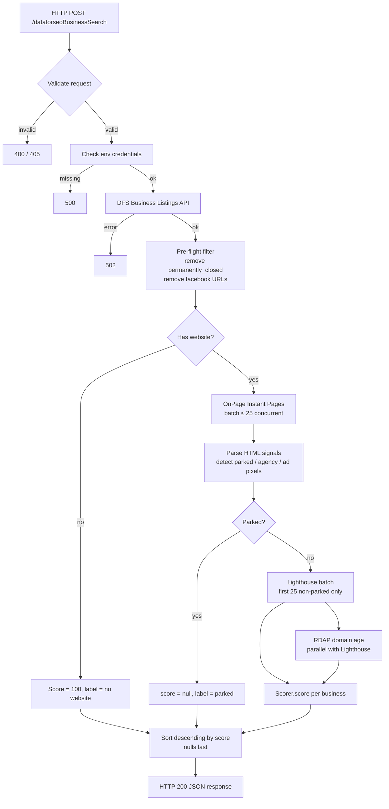

# Design Document: dataforseo-business-search

## Overview

A Firebase HTTP Cloud Function (`dataforseoBusinessSearch`) that orchestrates a multi-phase pipeline:

1. Discover local businesses via DataForSEO Business Listings API
2. Extract HTML signals from each business website via DataForSEO OnPage Instant Pages
3. Filter parked domains
4. Run Lighthouse analysis on the first 25 non-parked sites (single batch, capped)
5. Look up domain age via RDAP (parallel with Lighthouse)
6. Score each business using an isolated Scorer module
7. Return a sorted JSON array

The function is written in TypeScript and lives in `functions/src/index.ts` alongside existing functions. The Scorer is a pure function in a separate file (`functions/src/scorer.ts`) so it can be tested and adjusted independently.

---

## Architecture



---

## Components and Interfaces

### File layout

```
functions/src/
  index.ts          — HTTP handler + pipeline orchestration
  scorer.ts         — pure scoring function (isolated)
  dfsClient.ts      — DataForSEO API calls (business search, instant pages, lighthouse)
  rdap.ts           — RDAP domain age lookup
  types.ts          — shared TypeScript interfaces
```

### `types.ts`

```typescript
export interface BusinessRaw {
  title: string;
  address: string | null;
  phone: string | null;
  domain: string | null;
  url: string | null;
  rating: { value: number | null; votes_count: number | null } | null;
  category: string | null;
  is_claimed: boolean;
  permanently_closed: boolean;
}

export interface HtmlSignals {
  wordCount: number;
  hasMetaDescription: boolean;
  hasFavicon: boolean;
  isHttps: boolean;
  deprecatedTagCount: number;
  copyrightYear: number | null;
  footerText: string;
  hasAdPixel: boolean;
  hasAgencyFooter: boolean;
}

export interface ScorerInput {
  website: string | null;
  htmlSignals: HtmlSignals | null;
  lighthousePerformance: number | null; // 0–1
  lighthouseSeo: number | null;         // 0–1
  domainAgeYears: number | null;
}

export type BusinessLabel = "no website" | "parked" | "opportunity" | "low opportunity";

export interface ScoredBusiness {
  name: string;
  address: string | null;
  phone: string | null;
  website: string | null;
  rating: number | null;
  reviewCount: number | null;
  category: string | null;
  score: number | null;
  label: BusinessLabel;
}

export interface SearchResponse {
  results: ScoredBusiness[];
  timedOut?: boolean;
}
```

### `scorer.ts`

Pure function — no I/O, no side effects. Accepts a `ScorerInput` and returns `{ score: number | null, label: BusinessLabel }`.

```typescript
export function score(input: ScorerInput): { score: number | null; label: BusinessLabel }
```

Scoring rules (all additive from 0, then clamped 0–100):

| Condition | Points |
|---|---|
| No HTTPS | +30 |
| No meta description | +20 |
| No favicon | +10 |
| Deprecated tags > 0 | +15 |
| Copyright year > 2 years old | +10 |
| Word count < 300 | +10 |
| Lighthouse performance penalty | +`floor((1 - perf) * 20)` |
| Lighthouse SEO penalty | +`floor((1 - seo) * 15)` |
| Domain age < 2 years | +10 |
| Ad pixel detected | −10 |
| Agency footer detected | −15 |

Null signals contribute 0 penalty. Score clamped to [0, 100].

Label assignment: score ≥ 60 → `"opportunity"`, score < 60 → `"low opportunity"`.

### `dfsClient.ts`

Three exported async functions:

```typescript
export async function searchBusinesses(
  keyword: string,
  location: string,
  authHeader: string
): Promise<BusinessRaw[]>

export async function fetchInstantPages(
  urls: string[],
  authHeader: string
): Promise<(HtmlSignals | null)[]>

export async function fetchLighthouse(
  urls: string[],
  authHeader: string
): Promise<({ performance: number; seo: number } | null)[]>
```

`fetchInstantPages` and `fetchLighthouse` both use `Promise.allSettled` internally and return results in the same order as the input array.

### `rdap.ts`

```typescript
export async function lookupDomainAge(domain: string): Promise<number | null>
```

Selects the correct RDAP endpoint based on TLD, parses the `registration` event date, returns age in years.

### `index.ts` — pipeline orchestration

The HTTP handler:
1. Validates request method and body
2. Checks env vars
3. Calls `searchBusinesses` → pre-flight filter
4. Splits businesses into `noWebsite` and `hasWebsite` groups
5. Calls `fetchInstantPages` for all `hasWebsite` in batches of 25
6. Classifies parked domains
7. Calls `fetchLighthouse` for first 25 non-parked (single batch)
8. Calls `lookupDomainAge` for all non-parked in parallel with Lighthouse
9. Calls `score()` for each business
10. Sorts and returns

Timeout: wraps the pipeline in a `Promise.race` against a 290-second timer (10s buffer before Firebase's 300s limit). If the timer wins, returns partial results with `timedOut: true`.

---

## Data Models

### DataForSEO Business Listings response (relevant fields)

```
tasks[0].result[0].items[]: {
  title: string
  address: string
  phone: string
  domain: string
  url: string
  rating: { value: number, votes_count: number }
  category: string
  is_claimed: boolean
  permanently_closed: boolean
}
```

### DataForSEO OnPage Instant Pages response (relevant fields)

```
tasks[0].result[0].items[0]: {
  meta: {
    content: { words_count: number }
    description: string | null
    favicon: string | null
    charset: string
  }
  page_timing: { ... }
  resource_errors: [...]
  checks: { is_https: boolean, deprecated_tags: number }
  custom_js_response: string   // JSON-encoded { footerText, copyrightYear }
  resources: { external_resources: [{ url: string }] }
}
```

### DataForSEO Lighthouse response (relevant fields)

```
tasks[0].result[0].categories: {
  performance: { score: number }  // 0–1
  seo: { score: number }          // 0–1
}
```

### RDAP response (relevant fields)

```
{
  events: [
    { eventAction: "registration", eventDate: "2018-03-15T..." },
    ...
  ]
}
```

### `custom_js` snippet

```javascript
(function() {
  var bodyText = document.body ? document.body.innerText : '';
  var footer = bodyText.substring(Math.max(0, bodyText.length - 500));
  var match = footer.match(/\b(19|20)\d{2}\b/);
  return JSON.stringify({
    footerText: footer,
    copyrightYear: match ? parseInt(match[0], 10) : null
  });
})()
```

### Parking detection keywords

```
["buy this domain", "domain for sale", "parked", "this domain is for sale",
 "register this domain", "domain parking"]
```

### Agency footer patterns

```
[/built by/i, /designed by/i, /powered by/i, /web design by/i,
 /developed by/i, /created by/i, /a .+ agency/i]
```

### Ad pixel domains

```
["googletagmanager.com", "google-analytics.com", "googleadservices.com",
 "facebook.net", "connect.facebook.net", "ads.linkedin.com",
 "static.ads-twitter.com", "snap.licdn.com"]
```

---

## Correctness Properties

*A property is a characteristic or behavior that should hold true across all valid executions of a system — essentially, a formal statement about what the system should do. Properties serve as the bridge between human-readable specifications and machine-verifiable correctness guarantees.*


### Property 1: Pre-flight filter removes disqualified businesses

*For any* list of businesses returned by the DFS API, the pre-flight filter should remove all businesses that are `permanently_closed` or have a Facebook URL as their website. No permanently-closed or Facebook-URL business should appear in the pipeline output.

**Validates: Requirements 2.4, 2.5**

---

### Property 2: Basic Auth header construction

*For any* email and password string pair, the constructed Basic Auth header should equal `"Basic " + Buffer.from(email + ":" + password).toString("base64")`. The encoding is deterministic and reversible.

**Validates: Requirements 2.2**

---

### Property 3: HTML signal extraction from Instant Pages response

*For any* valid DataForSEO Instant Pages response object, the signal extraction function should return an `HtmlSignals` object where each field correctly reflects the corresponding value in the response (word count, meta description presence, favicon presence, HTTPS status, deprecated tag count, copyright year, footer text, ad pixel presence, agency footer presence).

**Validates: Requirements 3.3, 3.4**

---

### Property 4: custom_js footer extraction

*For any* body text string, the custom_js logic should return the last 500 characters of the string as `footerText`, and the first 4-digit year matching `(19|20)\d{2}` found in that footer as `copyrightYear` (or null if none found).

**Validates: Requirements 3.2**

---

### Property 5: Parked domain classification

*For any* `HtmlSignals` object, `isParked` should return `true` if and only if `wordCount < 100` OR `footerText` contains at least one parking keyword (case-insensitive). All other inputs should return `false`.

**Validates: Requirements 4.1**

---

### Property 6: Parked businesses have null score and "parked" label in response

*For any* business classified as parked, the corresponding entry in the final response array should have `score: null` and `label: "parked"`.

**Validates: Requirements 4.3**

---

### Property 7: Lighthouse cap — at most 25 URLs submitted

*For any* list of non-parked businesses of arbitrary length, the Lighthouse API should be called with at most 25 URLs. Businesses beyond position 25 in the non-parked list should have `null` Lighthouse scores in the scorer input.

**Validates: Requirements 5.1, 5.2**

---

### Property 8: Lighthouse scores extracted as 0–1 values

*For any* valid DataForSEO Lighthouse response, the extracted `performance` and `seo` scores should each be a number in the closed interval [0, 1].

**Validates: Requirements 5.4**

---

### Property 9: RDAP endpoint selection by TLD

*For any* domain string, the RDAP URL selector should return:
- `https://rdap.verisign.com/com/v1/domain/{domain}` for `.com` domains
- `https://rdap.verisign.com/net/v1/domain/{domain}` for `.net` domains
- `https://rdap.iana.org/domain/{domain}` for all other TLDs

**Validates: Requirements 6.2, 6.3, 6.4**

---

### Property 10: Domain age computation

*For any* RDAP response containing a `registration` event date, the computed domain age in years should equal `floor((now - registrationDate) / millisPerYear)`, and should be a non-negative number.

**Validates: Requirements 6.5**

---

### Property 11: Scorer applies correct penalties

*For any* `ScorerInput`, the raw (pre-clamp) score should equal the sum of all applicable penalty contributions:
- +30 if not HTTPS
- +20 if no meta description
- +10 if no favicon
- +15 if deprecated tag count > 0
- +10 if copyright year is more than 2 years before current year
- +10 if word count < 300
- +`floor((1 - performance) * 20)` for Lighthouse performance (0 if null)
- +`floor((1 - seo) * 15)` for Lighthouse SEO (0 if null)
- +10 if domain age < 2 years (0 if null)
- −10 if ad pixel detected
- −15 if agency footer detected
- Null HTML signals contribute 0 to all HTML-based penalties

**Validates: Requirements 7.2–7.17**

---

### Property 12: Score is always clamped to [0, 100]

*For any* `ScorerInput`, the final score returned by the Scorer should satisfy `0 ≤ score ≤ 100`. No combination of penalties or bonuses should produce a score outside this range.

**Validates: Requirements 7.14**

---

### Property 13: Label assignment is consistent with score

*For any* scored business with a non-null score, the label should be `"opportunity"` if `score >= 60` and `"low opportunity"` if `score < 60`. The label should never be `"opportunity"` for a score below 60 or `"low opportunity"` for a score of 60 or above.

**Validates: Requirements 9.5, 9.6**

---

### Property 14: No-website businesses score 100 with correct label

*For any* business with a null or absent website, the scorer output should be `{ score: 100, label: "no website" }`.

**Validates: Requirements 8.1**

---

### Property 15: Response is sorted descending by score, nulls last

*For any* list of scored businesses, the response array should be sorted such that: all non-null scores appear before null scores, and non-null scores appear in non-increasing order (each score ≥ the next).

**Validates: Requirements 9.2**

---

### Property 16: Every response business object contains all required fields

*For any* scored business in the response, the object should contain all of: `name`, `address`, `phone`, `website`, `rating`, `reviewCount`, `category`, `score`, and `label`. No required field should be absent or undefined.

**Validates: Requirements 9.3**

---

## Error Handling

| Scenario | Behavior |
|---|---|
| Missing `keyword` or `location` in body | HTTP 400, JSON `{ error: "..." }` |
| Non-POST method | HTTP 405 |
| Missing `DFS_EMAIL` or `DFS_PASSWORD` env vars | HTTP 500, JSON `{ error: "Missing configuration: ..." }` |
| DFS business listings API failure | HTTP 502, JSON `{ error: "..." }` |
| Individual Instant Pages request failure | Null `HtmlSignals` for that business; pipeline continues |
| Individual Lighthouse request failure | Null Lighthouse scores for that business; pipeline continues |
| Individual RDAP lookup failure | Null domain age for that business; pipeline continues |
| Pipeline timeout (290s race) | HTTP 200, partial results, `{ results: [...], timedOut: true }` |

All errors from individual business enrichment steps are isolated — one failure does not abort the pipeline. Only the top-level DFS business search failure is fatal (502).

---

## Testing Strategy

### Dual approach

Both unit tests and property-based tests are required. They are complementary:
- Unit tests cover specific examples, integration points, and error conditions
- Property tests verify universal correctness across all valid inputs

### Property-based testing library

Use **`fast-check`** (TypeScript-native, well-maintained, works with Jest/Vitest).

Install: `npm install --save-dev fast-check`

Each property test should run a minimum of **100 iterations** (`numRuns: 100` in fast-check config).

Each property test must include a comment referencing the design property it validates:
```
// Feature: dataforseo-business-search, Property N: <property title>
```

### Unit test targets

- HTTP handler: valid request, missing fields, wrong method, missing env vars, DFS 502
- `searchBusinesses`: correct request shape, response parsing
- `fetchInstantPages`: correct batching, null on failure
- `fetchLighthouse`: correct request shape (mobile, categories), null on failure
- `lookupDomainAge`: correct endpoint selection per TLD, null on failure
- Sorting: nulls last, descending order

### Property test targets (one test per property)

Each correctness property in this document maps to exactly one property-based test:

| Property | Test description |
|---|---|
| P1 | Pre-flight filter removes permanently_closed and Facebook URLs |
| P2 | Basic Auth header construction is correct for any email/password |
| P3 | HTML signal extraction matches response fields |
| P4 | custom_js footer extraction returns last 500 chars and copyright year |
| P5 | Parked classification: wordCount < 100 OR parking keyword in footer |
| P6 | Parked businesses have null score and "parked" label |
| P7 | Lighthouse receives at most 25 URLs regardless of input size |
| P8 | Lighthouse scores are always in [0, 1] |
| P9 | RDAP endpoint selected correctly by TLD |
| P10 | Domain age is non-negative and computed correctly |
| P11 | Scorer penalty sum is correct for all signal combinations |
| P12 | Score is always clamped to [0, 100] |
| P13 | Label is "opportunity" iff score ≥ 60 |
| P14 | No-website businesses always score 100 with "no website" label |
| P15 | Response sorted descending by score, nulls last |
| P16 | Every response object contains all required fields |
