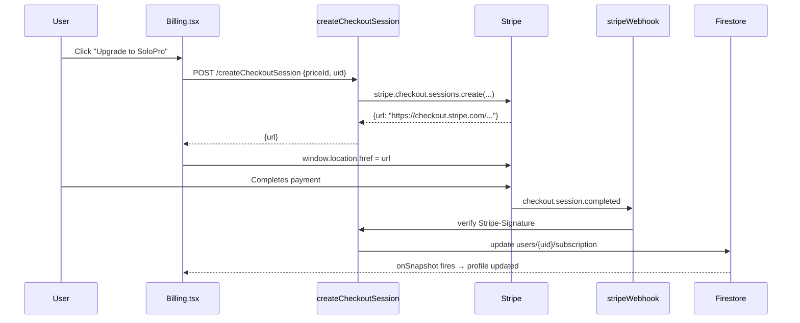
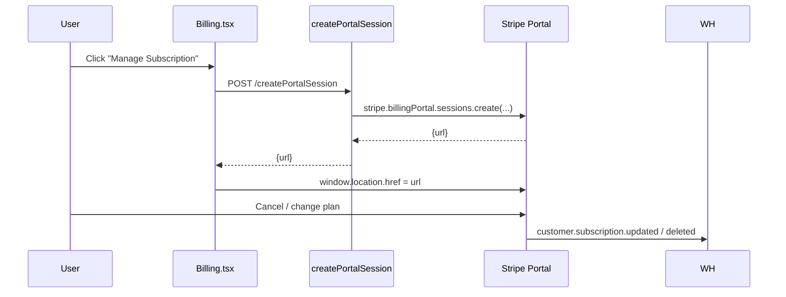
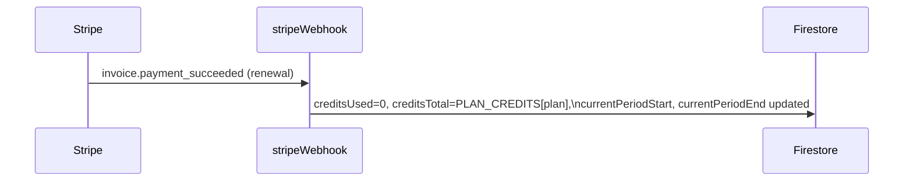

# Design Document: Stripe Subscription Billing

## Overview

This feature replaces the existing stub subscription model with a fully functional Stripe-integrated billing system. The platform will offer four tiers (Free, SoloPro, Agency, Pro) with per-plan search credit limits and feature flags, backed by Stripe Checkout for new subscriptions, Stripe Customer Portal for self-service management, and Stripe Webhooks to keep Firestore in sync with billing state.

The existing credit-deduction logic in `dataforseoBusinessSearch` is preserved as-is; only the plan names, credit limits, and the mechanism for setting/resetting those limits changes. Feature gating (save leads, script generation) is derived from the plan name at runtime — no separate flags are stored in Firestore.

## Architecture

```mermaid
graph TD
    FE[Frontend / React]
    CF[Cloud Functions]
    FS[Firestore]
    ST[Stripe API]
    WH[Stripe Webhooks]

    FE -->|createCheckoutSession| CF
    FE -->|createPortalSession| CF
    CF -->|create session| ST
    ST -->|redirect| FE
    WH -->|POST /stripeWebhook| CF
    CF -->|verify sig + update subscription| FS
    FE -->|onSnapshot users/{uid}| FS
```

## Sequence Diagrams

### New Subscription Flow



### Subscription Management Flow



### Credit Reset on Renewal



## Components and Interfaces

### Component: `createCheckoutSession` (Cloud Function)

**Purpose**: Creates a Stripe Checkout session for a new or upgraded subscription.

**Interface**:
```typescript
// Request body
interface CreateCheckoutSessionRequest {
  priceId: string; // Stripe Price ID for the selected plan
}

// Response
interface CreateCheckoutSessionResponse {
  url: string; // Stripe-hosted checkout URL
}
```

**Responsibilities**:
- Verify Firebase auth token (verifyUserRole)
- Look up or create Stripe Customer for the uid (idempotent via stripeCustomerId on profile)
- Create `stripe.checkout.sessions.create` with `mode: "subscription"`, success/cancel URLs
- Return the session URL

### Component: `createPortalSession` (Cloud Function)

**Purpose**: Creates a Stripe Customer Portal session for managing/canceling subscriptions.

**Interface**:
```typescript
// No request body needed (uid from auth token)
interface CreatePortalSessionResponse {
  url: string;
}
```

**Responsibilities**:
- Verify Firebase auth token
- Read `stripeCustomerId` from Firestore user profile
- Call `stripe.billingPortal.sessions.create`
- Return portal URL

### Component: `stripeWebhook` (Cloud Function)

**Purpose**: Receives and processes Stripe webhook events to keep Firestore subscription state authoritative.

**Interface**:
```typescript
// Handled event types
type WebhookEvent =
  | "checkout.session.completed"
  | "customer.subscription.updated"
  | "customer.subscription.deleted"
  | "invoice.payment_succeeded"   // credit reset on renewal
  | "invoice.payment_failed";
```

**Responsibilities**:
- Verify `Stripe-Signature` header using `stripe.webhooks.constructEvent`
- Reject unverified requests with 400
- Look up uid from `stripeCustomerId` via Firestore query
- Update `users/{uid}/subscription` atomically
- Return 200 immediately (idempotent — re-processing same event is safe)

### Component: `Billing.tsx` (Frontend Page)

**Purpose**: Displays current plan, credit usage, plan cards with live Stripe Checkout redirect, and a portal link for paid subscribers.

**Responsibilities**:
- Read plan/credits from `useCredits()` hook (no changes to hook internals needed)
- Render four plan cards with correct pricing and feature lists
- Call `createCheckoutSession` on upgrade click → redirect to Stripe
- Call `createPortalSession` on "Manage" click → redirect to portal
- Show "Manage Subscription" button only when `stripeSubscriptionId` is non-null

### Component: Feature Gate Utilities (Frontend)

**Purpose**: Derive feature availability from plan name at runtime.

**Interface**:
```typescript
// frontend/src/lib/planFeatures.ts
export type SubscriptionPlan = "free" | "soloPro" | "agency" | "pro";

export interface PlanFeatures {
  searches: number;
  canSaveLeads: boolean;
  canGenerateScripts: boolean;
}

export function getPlanFeatures(plan: SubscriptionPlan): PlanFeatures;
export function canSaveLeads(plan: SubscriptionPlan): boolean;
export function canGenerateScripts(plan: SubscriptionPlan): boolean;
```

## Data Models

### Updated `Subscription` (functions/src/types.ts)

```typescript
export type SubscriptionPlan = "free" | "soloPro" | "agency" | "pro";

export const PLAN_CREDITS: Record<SubscriptionPlan, number> = {
  free: 3,
  soloPro: 30,
  agency: 100,
  pro: 250,
};

// Maps Stripe Price IDs to plan names (set via env vars)
export const STRIPE_PRICE_TO_PLAN: Record<string, SubscriptionPlan> = {
  [process.env.STRIPE_PRICE_SOLOPRO!]: "soloPro",
  [process.env.STRIPE_PRICE_AGENCY!]:  "agency",
  [process.env.STRIPE_PRICE_PRO!]:     "pro",
};

export interface Subscription {
  plan: SubscriptionPlan;
  status: "active" | "past_due" | "cancelled" | "trialing";
  creditsUsed: number;
  creditsTotal: number;
  currentPeriodStart: Timestamp | null;
  currentPeriodEnd: Timestamp | null;
  stripeCustomerId: string | null;
  stripeSubscriptionId: string | null;
  cancelAtPeriodEnd: boolean;
}
```

**Validation Rules**:
- `creditsUsed` must be `>= 0` and `<= creditsTotal`
- `creditsTotal` must equal `PLAN_CREDITS[plan]` after any webhook update
- `stripeCustomerId` is set once on first checkout and never changed
- `stripeSubscriptionId` is null for free plan users

### Firestore Document Shape (`users/{uid}`)

No new top-level fields. The `subscription` sub-object is updated in-place by webhooks. The `stripeCustomerId` field already exists on the schema.

### Plan → Feature Mapping (derived, not stored)

| Plan    | searches/mo | canSaveLeads | canGenerateScripts |
|---------|-------------|--------------|-------------------|
| free    | 3           | false        | false             |
| soloPro | 30          | true         | false             |
| agency  | 100         | true         | true              |
| pro     | 250         | true         | true              |

## Algorithmic Pseudocode

### createCheckoutSession Algorithm

```pascal
PROCEDURE createCheckoutSession(req, res)
  INPUT: req.headers.authorization (Bearer token), req.body.priceId
  OUTPUT: HTTP 200 {url} or error

  SEQUENCE
    decodedToken ← verifyUserRole(req)
    uid ← decodedToken.uid

    userSnap ← db.collection("users").doc(uid).get()
    IF NOT userSnap.exists THEN
      RETURN HTTP 404 "User not found"
    END IF

    stripeCustomerId ← userSnap.data().subscription.stripeCustomerId

    IF stripeCustomerId IS NULL THEN
      customer ← stripe.customers.create({email, metadata: {uid}})
      stripeCustomerId ← customer.id
      db.collection("users").doc(uid).update({"subscription.stripeCustomerId": stripeCustomerId})
    END IF

    session ← stripe.checkout.sessions.create({
      customer: stripeCustomerId,
      mode: "subscription",
      line_items: [{price: req.body.priceId, quantity: 1}],
      success_url: FRONTEND_URL + "/billing?session_id={CHECKOUT_SESSION_ID}",
      cancel_url: FRONTEND_URL + "/billing",
      metadata: {uid}
    })

    RETURN HTTP 200 {url: session.url}
  END SEQUENCE
END PROCEDURE
```

**Preconditions**:
- `req.body.priceId` is a valid Stripe Price ID from the known set
- User is authenticated with a valid Firebase token

**Postconditions**:
- If `stripeCustomerId` was null, it is now set on the Firestore profile
- Returns a valid Stripe Checkout URL

### stripeWebhook Algorithm

```pascal
PROCEDURE stripeWebhook(req, res)
  INPUT: req.body (raw), req.headers["stripe-signature"]
  OUTPUT: HTTP 200 or 400

  SEQUENCE
    event ← stripe.webhooks.constructEvent(
      req.rawBody,
      req.headers["stripe-signature"],
      STRIPE_WEBHOOK_SECRET
    )

    IF constructEvent THROWS THEN
      RETURN HTTP 400 "Invalid signature"
    END IF

    CASE event.type OF
      "checkout.session.completed":
        uid ← event.data.object.metadata.uid
        stripeSubscriptionId ← event.data.object.subscription
        subscription ← stripe.subscriptions.retrieve(stripeSubscriptionId)
        plan ← STRIPE_PRICE_TO_PLAN[subscription.items.data[0].price.id]
        updateSubscription(uid, plan, subscription, "active")

      "customer.subscription.updated":
        uid ← lookupUidByCustomerId(event.data.object.customer)
        plan ← STRIPE_PRICE_TO_PLAN[event.data.object.items.data[0].price.id]
        status ← mapStripeStatus(event.data.object.status)
        updateSubscription(uid, plan, event.data.object, status)

      "customer.subscription.deleted":
        uid ← lookupUidByCustomerId(event.data.object.customer)
        downgradeToFree(uid)

      "invoice.payment_succeeded":
        // Only reset credits on renewal (not first payment — handled by checkout.session.completed)
        IF event.data.object.billing_reason == "subscription_cycle" THEN
          uid ← lookupUidByCustomerId(event.data.object.customer)
          resetCredits(uid, event.data.object)
        END IF

      "invoice.payment_failed":
        uid ← lookupUidByCustomerId(event.data.object.customer)
        db.collection("users").doc(uid).update({"subscription.status": "past_due"})
    END CASE

    RETURN HTTP 200 {received: true}
  END SEQUENCE
END PROCEDURE
```

**Preconditions**:
- `STRIPE_WEBHOOK_SECRET` env var is set
- Raw request body is available (not parsed by Express body-parser before this handler)

**Postconditions**:
- Firestore subscription state reflects Stripe's authoritative state
- Idempotent: re-processing the same event produces the same Firestore state

**Loop Invariants**: N/A (no loops)

### updateSubscription Helper

```pascal
PROCEDURE updateSubscription(uid, plan, stripeSubscription, status)
  INPUT: uid, plan: SubscriptionPlan, stripeSubscription, status: SubscriptionStatus
  OUTPUT: Firestore write

  SEQUENCE
    creditsTotal ← PLAN_CREDITS[plan]

    db.collection("users").doc(uid).update({
      "subscription.plan": plan,
      "subscription.status": status,
      "subscription.creditsTotal": creditsTotal,
      "subscription.stripeSubscriptionId": stripeSubscription.id,
      "subscription.cancelAtPeriodEnd": stripeSubscription.cancel_at_period_end,
      "subscription.currentPeriodStart": Timestamp.fromMillis(stripeSubscription.current_period_start * 1000),
      "subscription.currentPeriodEnd": Timestamp.fromMillis(stripeSubscription.current_period_end * 1000),
      updatedAt: FieldValue.serverTimestamp()
    })
  END SEQUENCE
END PROCEDURE
```

**Preconditions**:
- `plan` is a valid key in `PLAN_CREDITS`
- `uid` corresponds to an existing Firestore user document

**Postconditions**:
- `creditsTotal` equals `PLAN_CREDITS[plan]`
- `creditsUsed` is NOT reset here (only reset on `invoice.payment_succeeded` with `subscription_cycle`)

### resetCredits Helper

```pascal
PROCEDURE resetCredits(uid, invoice)
  INPUT: uid, invoice (Stripe Invoice object)
  OUTPUT: Firestore write

  SEQUENCE
    userSnap ← db.collection("users").doc(uid).get()
    plan ← userSnap.data().subscription.plan
    creditsTotal ← PLAN_CREDITS[plan]

    db.collection("users").doc(uid).update({
      "subscription.creditsUsed": 0,
      "subscription.creditsTotal": creditsTotal,
      "subscription.currentPeriodStart": Timestamp.fromMillis(invoice.period_start * 1000),
      "subscription.currentPeriodEnd": Timestamp.fromMillis(invoice.period_end * 1000),
      updatedAt: FieldValue.serverTimestamp()
    })
  END SEQUENCE
END PROCEDURE
```

**Preconditions**:
- Called only when `billing_reason === "subscription_cycle"`
- User document exists in Firestore

**Postconditions**:
- `creditsUsed === 0`
- `creditsTotal === PLAN_CREDITS[plan]`
- Period timestamps updated to new billing cycle

### lookupUidByCustomerId Helper

```pascal
FUNCTION lookupUidByCustomerId(stripeCustomerId): uid | null
  SEQUENCE
    snap ← db.collection("users")
              .where("subscription.stripeCustomerId", "==", stripeCustomerId)
              .limit(1)
              .get()

    IF snap.empty THEN
      RETURN null
    END IF

    RETURN snap.docs[0].id
  END SEQUENCE
END FUNCTION
```

**Preconditions**:
- `stripeCustomerId` is non-null

**Postconditions**:
- Returns the uid of the matching user, or null if not found
- At most one result (stripeCustomerId is unique per user)

## Key Functions with Formal Specifications

### `getPlanFeatures(plan)`

```typescript
function getPlanFeatures(plan: SubscriptionPlan): PlanFeatures
```

**Preconditions**:
- `plan` is one of `"free" | "soloPro" | "agency" | "pro"`

**Postconditions**:
- Returns `{ searches: PLAN_CREDITS[plan], canSaveLeads, canGenerateScripts }`
- `canSaveLeads === false` iff `plan === "free"`
- `canGenerateScripts === true` iff `plan === "agency" || plan === "pro"`
- Pure function — no side effects

### `verifyWebhookSignature(rawBody, signature, secret)`

```typescript
function verifyWebhookSignature(rawBody: Buffer, signature: string, secret: string): Stripe.Event
```

**Preconditions**:
- `rawBody` is the unmodified request body buffer
- `signature` is the `Stripe-Signature` header value
- `secret` is the webhook endpoint secret from Stripe Dashboard

**Postconditions**:
- Returns a verified `Stripe.Event` object
- Throws `Stripe.errors.StripeSignatureVerificationError` if signature is invalid
- No side effects

### Credit enforcement in `dataforseoBusinessSearch` (unchanged logic, updated types)

```typescript
// Existing transaction — only the type annotation changes
await db.runTransaction(async (tx) => {
  const sub = data.subscription as Subscription; // SubscriptionPlan now includes "soloPro" | "agency"
  if (sub.creditsUsed >= sub.creditsTotal) throw new Error("INSUFFICIENT_CREDITS");
  tx.update(userRef, { "subscription.creditsUsed": FieldValue.increment(1) });
});
```

**Preconditions**:
- `sub.creditsUsed >= 0`
- `sub.creditsTotal === PLAN_CREDITS[sub.plan]`

**Postconditions**:
- If `creditsUsed < creditsTotal`: `creditsUsed` incremented by 1, search proceeds
- If `creditsUsed >= creditsTotal`: throws `INSUFFICIENT_CREDITS`, search rejected with HTTP 402

**Loop Invariants**: N/A (single transaction, no loops)

## Example Usage

```typescript
// Frontend: Upgrade button click handler
async function handleUpgrade(priceId: string) {
  const token = await getAuthToken();
  const res = await fetch("/api/createCheckoutSession", {
    method: "POST",
    headers: { "Content-Type": "application/json", Authorization: `Bearer ${token}` },
    body: JSON.stringify({ priceId }),
  });
  const { url } = await res.json();
  window.location.href = url; // redirect to Stripe Checkout
}

// Frontend: Manage subscription button
async function handleManage() {
  const token = await getAuthToken();
  const res = await fetch("/api/createPortalSession", {
    method: "POST",
    headers: { Authorization: `Bearer ${token}` },
  });
  const { url } = await res.json();
  window.location.href = url;
}

// Frontend: Feature gate — save lead button
function SaveLeadButton({ plan }: { plan: SubscriptionPlan }) {
  if (!canSaveLeads(plan)) {
    return <UpgradePrompt message="Upgrade to SoloPro to save leads" />;
  }
  return <Button onClick={saveLead}>Save Lead</Button>;
}

// Frontend: Feature gate — script generation
function ScriptGenButton({ plan }: { plan: SubscriptionPlan }) {
  if (!canGenerateScripts(plan)) {
    return <UpgradePrompt message="Upgrade to Agency or Pro for script generation" />;
  }
  return <Button onClick={generateScript}>Generate Script</Button>;
}
```

## Correctness Properties

*A property is a characteristic or behavior that should hold true across all valid executions of a system — essentially, a formal statement about what the system should do. Properties serve as the bridge between human-readable specifications and machine-verifiable correctness guarantees.*

### P1: Credit Enforcement — Cannot search with exhausted credits

*For any* subscription state where `creditsUsed >= creditsTotal`, the credit check function must return `"INSUFFICIENT_CREDITS"` and the search must be rejected with HTTP 402.

```typescript
// Property: for any user with creditsUsed >= creditsTotal, search is rejected
fc.assert(fc.property(
  fc.record({
    creditsUsed: fc.nat(),
    creditsTotal: fc.nat(),
  }).filter(({ creditsUsed, creditsTotal }) => creditsUsed >= creditsTotal),
  ({ creditsUsed, creditsTotal }) => {
    const result = checkCredits({ creditsUsed, creditsTotal });
    return result === "INSUFFICIENT_CREDITS";
  }
));
```

**Validates: Requirements 6.1, 6.2**

### P2: Plan Feature Gating — Feature flags are deterministic and consistent with plan hierarchy

*For any* SubscriptionPlan value, `getPlanFeatures` must return the correct `canSaveLeads` and `canGenerateScripts` flags: free gets neither, soloPro gets canSaveLeads only, agency and pro get both.

```typescript
// Property: feature flags are deterministic and consistent with plan hierarchy
fc.assert(fc.property(
  fc.constantFrom("free", "soloPro", "agency", "pro" as SubscriptionPlan),
  (plan) => {
    const features = getPlanFeatures(plan);
    // Free can never save leads
    if (plan === "free") return !features.canSaveLeads && !features.canGenerateScripts;
    // SoloPro can save leads but not generate scripts
    if (plan === "soloPro") return features.canSaveLeads && !features.canGenerateScripts;
    // Agency and Pro have all features
    return features.canSaveLeads && features.canGenerateScripts;
  }
));
```

**Validates: Requirements 2.2, 2.3, 2.4, 2.5, 2.6, 2.7**

### P3: Webhook Idempotency — Duplicate events produce identical Firestore state

*For any* webhook event applied to any subscription state, applying the same event a second time must produce the same Firestore subscription state as the first application.

```typescript
// Property: applying the same webhook event twice produces the same Firestore state
fc.assert(fc.property(
  fc.record({
    plan: fc.constantFrom("soloPro", "agency", "pro"),
    creditsUsed: fc.nat({ max: 250 }),
    eventId: fc.string(),
  }),
  async ({ plan, creditsUsed, eventId }) => {
    const state1 = await applyWebhookEvent(eventId, { plan, creditsUsed });
    const state2 = await applyWebhookEvent(eventId, state1); // apply again
    return deepEqual(state1, state2);
  }
));
```

**Validates: Requirements 5.9**

### P4: Credit Reset on Renewal — creditsUsed resets to 0, creditsTotal matches plan

*For any* plan and any prior `creditsUsed` value, after applying an `invoice.payment_succeeded` renewal event, `creditsUsed` must equal 0 and `creditsTotal` must equal `PLAN_CREDITS[plan]`.

```typescript
// Property: after invoice.payment_succeeded (subscription_cycle), credits are fully reset
fc.assert(fc.property(
  fc.record({
    plan: fc.constantFrom("free", "soloPro", "agency", "pro"),
    creditsUsed: fc.nat({ max: 250 }),
  }),
  ({ plan, creditsUsed }) => {
    const after = applyRenewal({ plan, creditsUsed });
    return after.creditsUsed === 0 && after.creditsTotal === PLAN_CREDITS[plan];
  }
));
```

**Validates: Requirements 5.6, 1.4, 1.5**

### P5: Plan Credits Monotonicity — Higher-tier plans always have more credits

*For any* adjacent pair of plans in the ordering `free < soloPro < agency < pro`, the lower-tier plan must have strictly fewer credits than the higher-tier plan.

```typescript
// Property: plan credit ordering is free < soloPro < agency < pro
const planOrder: SubscriptionPlan[] = ["free", "soloPro", "agency", "pro"];
fc.assert(fc.property(
  fc.integer({ min: 0, max: 2 }),
  (i) => PLAN_CREDITS[planOrder[i]] < PLAN_CREDITS[planOrder[i + 1]]
));
```

**Validates: Requirements 1.2, 2.2, 2.3, 2.4, 2.5**

### P6: Migration Correctness — Legacy plan names are remapped and credits are capped

*For any* user document with a legacy plan name (`starter` or `enterprise`) and any `creditsUsed` value, after running the migration function the plan must be the correct new name, `creditsTotal` must equal `PLAN_CREDITS[newPlan]`, and `creditsUsed` must be `min(oldCreditsUsed, newCreditsTotal)`.

```typescript
// Property: for any user with a legacy plan, migration produces correct new plan and capped credits
fc.assert(fc.property(
  fc.record({
    plan: fc.constantFrom("starter", "enterprise", "free", "soloPro", "agency", "pro"),
    creditsUsed: fc.nat({ max: 10000 }),
  }),
  ({ plan, creditsUsed }) => {
    const after = applyMigration({ plan, creditsUsed });
    const planMap: Record<string, SubscriptionPlan> = {
      starter: "soloPro", enterprise: "pro",
      free: "free", soloPro: "soloPro", agency: "agency", pro: "pro",
    };
    const expectedPlan = planMap[plan];
    const expectedTotal = PLAN_CREDITS[expectedPlan];
    return (
      after.plan === expectedPlan &&
      after.creditsTotal === expectedTotal &&
      after.creditsUsed === Math.min(creditsUsed, expectedTotal)
    );
  }
));
```

**Validates: Requirements 10.1, 10.2, 10.3, 10.5**

### P7: Stripe Customer Idempotency — Existing stripeCustomerId is never overwritten

*For any* user who already has a non-null `stripeCustomerId`, calling `createCheckoutSession` must reuse the existing customer ID and must not create a new Stripe Customer.

```typescript
// Property: for any user with an existing stripeCustomerId, checkout reuses it
fc.assert(fc.property(
  fc.record({
    stripeCustomerId: fc.string({ minLength: 1 }),
    priceId: fc.constantFrom(
      process.env.STRIPE_PRICE_SOLOPRO!,
      process.env.STRIPE_PRICE_AGENCY!,
      process.env.STRIPE_PRICE_PRO!
    ),
  }),
  async ({ stripeCustomerId, priceId }) => {
    const createCustomerSpy = jest.fn();
    const result = await createCheckoutSessionWithExistingCustomer(
      { stripeCustomerId, priceId },
      { createCustomer: createCustomerSpy }
    );
    return createCustomerSpy.mock.calls.length === 0 && result.customerId === stripeCustomerId;
  }
));
```

**Validates: Requirements 11.2**

## Error Handling

### Webhook Signature Failure

**Condition**: `Stripe-Signature` header is missing or invalid
**Response**: HTTP 400 `{ error: "Invalid webhook signature" }`
**Recovery**: Stripe will retry the event; no Firestore state is changed

### Stripe Customer Not Found

**Condition**: `lookupUidByCustomerId` returns null (customer exists in Stripe but not in Firestore)
**Response**: Log error, return HTTP 200 to Stripe (prevent infinite retries)
**Recovery**: Manual investigation; this should not happen in normal operation

### Checkout Session with Unknown Price ID

**Condition**: `priceId` in request body is not in `STRIPE_PRICE_TO_PLAN`
**Response**: HTTP 400 `{ error: "Invalid plan selected" }`
**Recovery**: Frontend should only send known price IDs from the plan config

### Payment Failed

**Condition**: `invoice.payment_failed` webhook received
**Response**: Set `subscription.status = "past_due"` in Firestore
**Recovery**: Stripe retries payment per dunning settings; user sees "past_due" banner in UI; search credits are not revoked immediately (grace period)

### Portal Session — No Stripe Customer

**Condition**: User calls `createPortalSession` but has no `stripeCustomerId` (free plan user)
**Response**: HTTP 400 `{ error: "No active subscription to manage" }`
**Recovery**: Frontend hides the "Manage" button for free users; this is a defensive check

## Migration Strategy

Existing users on old plan names (`starter`, `enterprise`) must be migrated to the new schema.

### Migration Approach: Cloud Function + Firestore Batch Write

```pascal
PROCEDURE migrateExistingUsers()
  SEQUENCE
    // Map old plan names to new equivalents
    planMap ← {
      "free":       "free",
      "starter":    "soloPro",   // closest equivalent by credit count
      "pro":        "pro",
      "enterprise": "pro"        // downgrade to highest new tier
    }

    users ← db.collection("users").get()

    FOR each userDoc IN users DO
      oldPlan ← userDoc.data().subscription.plan
      newPlan ← planMap[oldPlan] ?? "free"
      newCreditsTotal ← PLAN_CREDITS[newPlan]

      batch.update(userDoc.ref, {
        "subscription.plan": newPlan,
        "subscription.creditsTotal": newCreditsTotal,
        // creditsUsed: preserve as-is (capped to new total if needed)
        "subscription.creditsUsed": min(userDoc.data().subscription.creditsUsed, newCreditsTotal)
      })
    END FOR

    batch.commit()
  END SEQUENCE
END PROCEDURE
```

**Notes**:
- Run as a one-time admin Cloud Function before deploying new plan types
- `enterprise` users are mapped to `pro` (250 searches) — notify them separately if needed
- `starter` users are mapped to `soloPro` (30 searches) — this is a reduction from 500; notify affected users

## Testing Strategy

### Unit Testing Approach

Test pure functions in isolation:
- `getPlanFeatures(plan)` — all four plans, verify feature flags
- `PLAN_CREDITS` lookup — verify all plan keys return correct values
- `mapStripeStatus(stripeStatus)` — verify all Stripe status strings map correctly
- `buildDefaultSubscription(plan)` — verify creditsTotal matches PLAN_CREDITS

### Property-Based Testing Approach

**Property Test Library**: fast-check

See Correctness Properties section (P1–P7) above. Key properties:
- Credit enforcement is never bypassed regardless of creditsUsed/creditsTotal values (P1)
- Feature flags are always consistent with plan hierarchy (P2)
- Webhook processing is idempotent (P3)
- Credit reset always produces creditsUsed=0 and creditsTotal=PLAN_CREDITS[plan] (P4)
- Plan credit ordering is strictly monotonic (P5)
- Migration correctly remaps legacy plans and caps credits (P6)
- Stripe customer creation is idempotent — existing IDs are never overwritten (P7)

### Integration Testing Approach

Use Stripe's test mode with test clock for time-sensitive scenarios:
- Full checkout flow with test card `4242 4242 4242 4242`
- Webhook delivery using Stripe CLI (`stripe listen --forward-to localhost:5001/...`)
- Subscription cancellation via portal
- Payment failure simulation with test card `4000 0000 0000 0341`
- Credit reset on renewal using Stripe test clock advance

## Security Considerations

### Webhook Signature Verification

All webhook events must be verified using `stripe.webhooks.constructEvent` with the endpoint-specific signing secret. Raw body must be preserved (do not parse with `express.json()` before the webhook handler).

```typescript
// functions/src/index.ts — webhook handler must use raw body
export const stripeWebhook = functions.https.onRequest((req, res) => {
  const sig = req.headers["stripe-signature"] as string;
  let event: Stripe.Event;
  try {
    event = stripe.webhooks.constructEvent(req.rawBody, sig, STRIPE_WEBHOOK_SECRET);
  } catch {
    res.status(400).send("Invalid signature");
    return;
  }
  // ...
});
```

### Users Cannot Self-Upgrade via Firestore

Firestore rules already block all client writes to `users/{uid}` (only Admin SDK can write). Subscription state is only updated by:
1. `stripeWebhook` Cloud Function (via Admin SDK)
2. `createCheckoutSession` (only sets `stripeCustomerId`, not plan/credits)

### Stripe Price IDs as Environment Variables

Price IDs are stored in `functions/.env` (not hardcoded), so they can differ between test and production environments without code changes.

```
STRIPE_SECRET_KEY=sk_live_...
STRIPE_WEBHOOK_SECRET=whsec_...
STRIPE_PRICE_SOLOPRO=price_...
STRIPE_PRICE_AGENCY=price_...
STRIPE_PRICE_PRO=price_...
```

### No PII in Stripe Metadata

Only `uid` (Firebase UID) is stored in Stripe metadata. Email is passed to `stripe.customers.create` for Stripe's own records but is not stored redundantly.

## Performance Considerations

- `lookupUidByCustomerId` queries `subscription.stripeCustomerId` — add a Firestore composite index on this field to avoid full collection scans
- Webhook handler should complete within 10 seconds (Stripe's timeout); all Firestore writes are single-document updates
- `createCheckoutSession` and `createPortalSession` are low-frequency (user-initiated) — no rate limiting needed beyond existing auth

## Dependencies

- `stripe` npm package (Node.js SDK) — add to `functions/package.json`
- Stripe account with products/prices configured for SoloPro, Agency, Pro plans
- Stripe Customer Portal configured in Stripe Dashboard (allowed features: cancel subscription, update payment method)
- `STRIPE_SECRET_KEY`, `STRIPE_WEBHOOK_SECRET`, `STRIPE_PRICE_*` env vars in `functions/.env`
- Frontend: no new npm dependencies (uses existing `fetch` + Firebase Auth token pattern)
