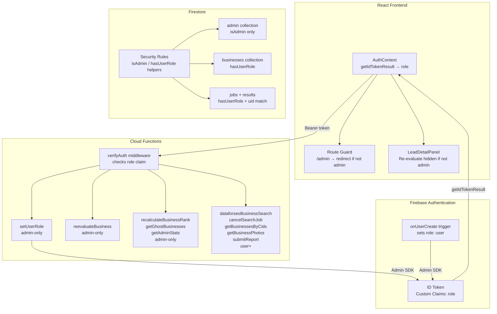

# Design Document: User Roles & Authorization

## Overview

This feature introduces a two-tier role system (`user` and `admin`) across the full stack of a Firebase-based React/TypeScript application. The design layers three independent enforcement mechanisms — Firebase Custom Claims, Firestore Security Rules, and Cloud Function middleware — so that no single layer is a single point of failure.

The key changes are:

- A `setUserRole` Cloud Function (callable by admins) and an `onUserCreate` Auth trigger that auto-assigns `role: "user"` to new accounts.
- Updated `verifyAuth` middleware that checks Custom Claims on every HTTP Cloud Function.
- Updated Firestore Security Rules that use `isAdmin()` / `hasUserRole()` helpers.
- An updated `AuthContext` that decodes and exposes the `role` claim from the ID token.
- Route-level and component-level UI guards that read from `AuthContext`.

### Design Decisions

- **Custom Claims as the sole authoritative source of role data.** Storing roles in Firestore user documents would create a second source of truth that could be read by client code. Custom Claims are server-set and embedded in the signed ID token, making them tamper-proof from the client.
- **`checkRevoked: true` on admin endpoints only.** Revocation checks add a Firestore read on every call. Applying them only to admin-only endpoints balances security with performance for regular user traffic.
- **Backward-compatible `user` role fallback.** Existing accounts have no `role` claim. Treating a missing claim as `user` avoids a hard cutover that would break existing sessions.
- **Token refresh after role change.** `revokeRefreshTokens` forces the client to re-authenticate, ensuring the new claim is picked up immediately rather than waiting up to 1 hour for natural token expiry.

---

## Architecture



---

## Components and Interfaces

### 1. `onUserCreate` Auth Trigger (new Cloud Function)

Fires on every new Firebase Auth account creation. Sets `role: "user"` via the Admin SDK and revokes refresh tokens to force a token refresh.

```typescript
export const onUserCreate = functions.auth.user().onCreate(async (user) => {
  await admin.auth().setCustomUserClaims(user.uid, { role: "user" });
  await admin.auth().revokeRefreshTokens(user.uid);
});
```

### 2. `setUserRole` Cloud Function (new HTTP function)

Admin-only endpoint to assign `"user"` or `"admin"` to any target UID. Validates caller has `role: "admin"`, validates the target role value, sets the claim, and revokes the target user's refresh tokens.

**Request:** `POST /setUserRole`
```json
{ "uid": "<target_uid>", "role": "admin" | "user" }
```

**Responses:**
- `200` — role set successfully
- `400` — invalid role value
- `401` — missing/invalid token
- `403` — caller is not admin
- `405` — wrong HTTP method

### 3. Updated `verifyAuth` middleware

The existing `verifyAuth` helper is extended into two variants:

```typescript
// Existing — verifies token is valid, returns decoded token
async function verifyAuth(req): Promise<DecodedIdToken>

// New — additionally checks role claim
async function verifyAdmin(req): Promise<DecodedIdToken>
// throws with code "FORBIDDEN" if role !== "admin"

// New — checks role is "user" or "admin" (backward-compat fallback)
async function verifyUserRole(req): Promise<DecodedIdToken>
// throws with code "FORBIDDEN" if role is unrecognized
```

Admin-only functions call `verifyAdmin`. User-level functions call `verifyUserRole`. Both use `checkRevoked: true` on admin endpoints.

### 4. Updated `AuthContext`

`AuthContext` is extended to decode the ID token on every auth state change and expose a `role` field.

```typescript
interface AuthContextValue {
  user: User | null;
  role: "user" | "admin" | null;  // NEW
  loading: boolean;
  signIn: (email: string, password: string) => Promise<void>;
  signUp: (email: string, password: string) => Promise<void>;
  logout: () => Promise<void>;
}
```

Role is obtained via `user.getIdTokenResult()` (not Firestore) on each `onAuthStateChanged` event.

### 5. `ProtectedAdminRoute` component (new)

A thin wrapper around React Router's `<Route>` that reads `role` from `AuthContext` and redirects non-admins.

```typescript
function ProtectedAdminRoute({ element }: { element: ReactNode }) {
  const { user, role, loading } = useAuth();
  if (loading) return <LoadingSpinner />;
  if (!user) return <Navigate to="/login" replace />;
  if (role !== "admin") return <Navigate to="/" replace />;
  return <>{element}</>;
}
```

### 6. `LeadDetailPanel` — Re-evaluate button guard

The Re-evaluate button is conditionally rendered based on `role`:

```tsx
const { role } = useAuth();
// ...
{role === "admin" && (
  <Button onClick={handleReevaluate} ...>Re-evaluate</Button>
)}
```

### 7. Bootstrap script

A one-time Node.js script (`scripts/bootstrap-admin.ts`) that uses the Firebase Admin SDK with a service account to set the initial admin claim on a given UID. This is run locally by the owner and is never deployed as a Cloud Function.

---

## Data Models

### Custom Claims shape

```typescript
interface UserClaims {
  role: "user" | "admin";
}
```

Stored in the Firebase ID token. Not stored in Firestore.

### Firestore `users/{uid}` document

No role field is added. The existing schema is unchanged. Role lives exclusively in Custom Claims.

### Firestore `admin` collection

Read access restricted to `isAdmin()`. No schema changes required.

---

## Correctness Properties

*A property is a characteristic or behavior that should hold true across all valid executions of a system — essentially, a formal statement about what the system should do. Properties serve as the bridge between human-readable specifications and machine-verifiable correctness guarantees.*

### Property 1: Missing role claim treated as user role

*For any* valid ID token that contains no `role` Custom Claim, the `verifyUserRole` middleware should treat the request as having the `user` role and allow it to proceed.

**Validates: Requirements 1.2**

### Property 2: Invalid role values are rejected

*For any* ID token whose `role` claim is a string other than `"user"` or `"admin"` (e.g., `"superuser"`, `""`), the `verifyUserRole` middleware should return HTTP 403.

**Validates: Requirements 3.2**

### Property 3: Admin endpoint rejects non-admin callers

*For any* valid ID token with `role: "user"` (or no role), calling any admin-only Cloud Function should return HTTP 403.

**Validates: Requirements 4.1, 5.1**

### Property 4: setUserRole only accepts valid role values

*For any* call to `setUserRole` with a `role` value that is not `"user"` or `"admin"`, the function should return HTTP 400 regardless of the caller's role.

**Validates: Requirements 2.3**

### Property 5: setUserRole requires admin caller

*For any* call to `setUserRole` by a caller whose token has `role: "user"` (or no role), the function should return HTTP 403.

**Validates: Requirements 2.2**

### Property 6: AuthContext role reflects token claims

*For any* authenticated user, the `role` exposed by `AuthContext` should equal the `role` field in the user's decoded ID token claims, and should be `null` when the user is unauthenticated.

**Validates: Requirements 6.1, 6.3**

### Property 7: Firestore admin collection blocks non-admins

*For any* Firestore read request to the `admin` collection where the caller's token does not have `role: "admin"`, the Security Rules should deny the request.

**Validates: Requirements 8.3**

### Property 8: Firestore businesses/jobs collections require user role

*For any* Firestore read request to the `businesses` or `jobs` collections where the caller's token has neither `role: "user"` nor `role: "admin"`, the Security Rules should deny the request.

**Validates: Requirements 8.4, 8.5**

---

## Error Handling

| Scenario | Layer | Response |
|---|---|---|
| Missing/invalid `Authorization` header | Cloud Function middleware | HTTP 401, generic message |
| Revoked token on admin endpoint | Cloud Function middleware | HTTP 401, generic message |
| Valid token but wrong role | Cloud Function middleware | HTTP 403, generic message |
| Invalid `role` value in `setUserRole` | `setUserRole` function | HTTP 400, descriptive message |
| Internal error during token verification | Cloud Function middleware | HTTP 401, no internal details leaked |
| Non-admin navigates to `/admin` | Frontend route guard | Redirect to `/` |
| Unauthenticated user navigates to `/admin` | Frontend route guard | Redirect to `/login` (via existing `AuthGate`) |
| Auth state still loading on `/admin` | Frontend route guard | Render loading spinner, no premature redirect |

**Logging:** Admin-only function 403 rejections log `uid` and function name. Full tokens are never logged.

---

## Testing Strategy

### Unit Tests

Unit tests cover specific examples and edge cases:

- `verifyUserRole` returns decoded token for `role: "user"` tokens
- `verifyUserRole` returns decoded token for `role: "admin"` tokens
- `verifyUserRole` throws FORBIDDEN for `role: "superuser"` tokens
- `verifyUserRole` treats missing `role` claim as `user` (backward compat)
- `verifyAdmin` throws FORBIDDEN for `role: "user"` tokens
- `verifyAdmin` throws FORBIDDEN for tokens with no role claim
- `setUserRole` returns 400 for invalid role values (`"superuser"`, `""`, `null`)
- `setUserRole` returns 403 when caller has `role: "user"`
- `ProtectedAdminRoute` redirects to `/` when `role === "user"`
- `ProtectedAdminRoute` redirects to `/login` when `user === null`
- `ProtectedAdminRoute` renders loading state when `loading === true`
- `AuthContext` exposes `role: null` when user is unauthenticated
- Re-evaluate button is not rendered when `role === "user"`
- Re-evaluate button is rendered when `role === "admin"`

### Property-Based Tests

Property tests use [fast-check](https://github.com/dubzzz/fast-check) (already available in the TypeScript ecosystem) with a minimum of 100 iterations per property.

Each test is tagged with a comment in the format:
`// Feature: user-roles-authorization, Property N: <property_text>`

**Property 1 — Missing role claim treated as user role**
Generate arbitrary valid token payloads with no `role` field. Assert `verifyUserRole` does not throw.
`// Feature: user-roles-authorization, Property 1: missing role claim treated as user role`

**Property 2 — Invalid role values are rejected**
Generate arbitrary strings that are not `"user"` or `"admin"`. Assert `verifyUserRole` throws with FORBIDDEN.
`// Feature: user-roles-authorization, Property 2: invalid role values are rejected`

**Property 3 — Admin endpoint rejects non-admin callers**
Generate token payloads with `role: "user"` or no role. Assert `verifyAdmin` throws with FORBIDDEN.
`// Feature: user-roles-authorization, Property 3: admin endpoint rejects non-admin callers`

**Property 4 — setUserRole only accepts valid role values**
Generate arbitrary strings that are not `"user"` or `"admin"`. Assert `setUserRole` returns HTTP 400.
`// Feature: user-roles-authorization, Property 4: setUserRole only accepts valid role values`

**Property 5 — setUserRole requires admin caller**
Generate token payloads with `role: "user"` or no role. Assert `setUserRole` returns HTTP 403.
`// Feature: user-roles-authorization, Property 5: setUserRole requires admin caller`

**Property 6 — AuthContext role reflects token claims**
Generate arbitrary role values (`"user"`, `"admin"`, `null`). Assert `AuthContext.role` equals the decoded token's role claim (or `null` when unauthenticated).
`// Feature: user-roles-authorization, Property 6: AuthContext role reflects token claims`

**Property 7 — Firestore admin collection blocks non-admins**
Generate Firestore rule evaluation contexts with tokens lacking `role: "admin"`. Assert `isAdmin()` returns false and read is denied.
`// Feature: user-roles-authorization, Property 7: Firestore admin collection blocks non-admins`

**Property 8 — Firestore businesses/jobs collections require user role**
Generate Firestore rule evaluation contexts with tokens having no recognized role. Assert `hasUserRole()` returns false and read is denied.
`// Feature: user-roles-authorization, Property 8: Firestore businesses/jobs collections require user role`
